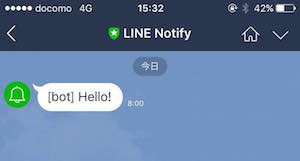
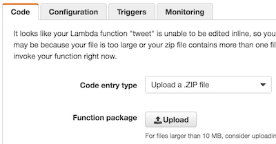
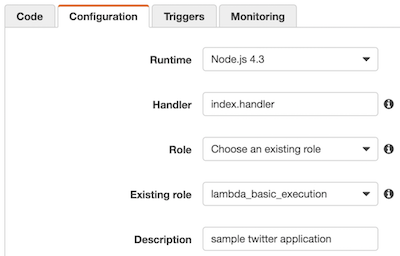

# lambda-linenotify-bot

This is a sample application of LINE Notify, works on AWS Lambda.

## Installation

    git clone https://github.com/hkusu/lambda-linenotify-bot
    npm install

Get your token of LINE Notify in [https://notify-bot.line.me/](https://notify-bot.line.me/), and set token to the `.env` file.

    TOKEN = your token

## Usage

### check the syntax of source code

    npm run lint

### monitoring and automated build of source code

    npm run watch

### run the application in the local environment

    npm run local-run

### create an archive

    npm run build

Upload the created app.zip in the console of the AWS Lambda.

## Settings in the AWS lambda

> Role, does not require special permissions.

Triggers, select the `CloudWatch Events(Schedule)`.

## Other documents

- [LINE Notify を AWS Lambda (Node.js) から利用してみた](http://qiita.com/hkusu/items/75aca4e92eaf02c00db5)
